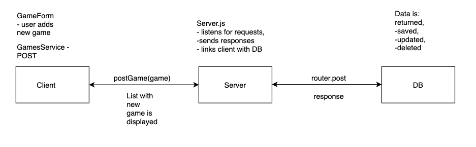

### DIAGRAM

### Questions

1. What is responsible for defining the routes of the `games` resource?

It is create_router.js file.

2. What do you notice about the folder structure?  Whats the client responsible for? Whats the server responsible for?

Folder structure is seperating the responsibilities. Client is responsible for displaying the data to the user, server is responsible for handling the requests from the client, connecting to database and sending coresponding responses.

3. What are the the responsibilities of server.js?

Server.js connects to DB and listens for requests.

4. What are the responsibilities of the `gamesRouter`?
'gamesRouter' creates a router for the collection 'games'. The routes are:
GET all games
GET one game by ID
POST new game
DELETE game
UPDATE game

5. What process does the the client (front-end) use to communicate with the server?

Representational State Transfer

6. What optional second argument does the `fetch` method take? And what is it used for in this application? Hint: See [Using Fetch](https://developer.mozilla.org/en-US/docs/Web/API/Fetch_API/Using_Fetch) on the MDN docs

'fetch' accepts init object as second optional argument. In this application it is used to POST new game or DELETE a game.

7. Which of the games API routes does the front-end application consume (i.e. make requests to)?

GET api/games/
POST api/games/
DELETE api/games/:id

8. What are we using the [MongoDB Driver](http://mongodb.github.io/node-mongodb-native/) for?

To connect our server with the DB.

